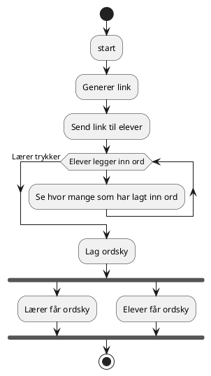
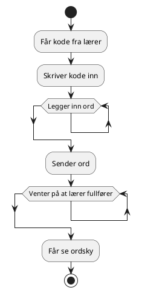

# Teacher and pupils flows

## The teacher



## The pupil



## Requirements

In order to accomplish this workflow, some things are needed:

- Link or code generation
- Websocket to wait for inputs
- Api that receives input
- Some storage of said input before creation of word cloud

Or an MVP might only need:

- Code generation
- API that receives input and generates cloud
- Some storage of said input before creation of word cloud
- Pupils must manually request word cloud?

## Architecture

### Simple version

```plantuml
@startuml
!includeurl https://raw.githubusercontent.com/RicardoNiepel/C4-PlantUML/release/1-0/C4_Container.puml

hide stereotype

Person(teacher, "Teacher", "Generates code and word cloud")
Person(pupil, "Pupil", "Inputs words")

System_Boundary(ordsky, "Ordsky.no") {

  Container(web, "Ordsky.no SPA", "React", "Displays and receives data")
  ContainerDb(cache, "Sessiondata", "DynamoDb", "Stores session data by id")
  Container(api, "API", "Node.js, EC2/ECS", "Starts and ends sessions, receives inputs and creates word clouds")
}

teacher --> web
pupil --> web
web <--> api
api <--> cache

@enduml
```

### Serverless

Docker/ECS/Fargate or Lambda?
Firebase functions with firestore?

#### AWS

```plantuml
@startuml
!includeurl https://raw.githubusercontent.com/RicardoNiepel/C4-PlantUML/release/1-0/C4_Container.puml

hide stereotype

Person(teacher, "Teacher", "Starts a session")
Person(pupil, "Pupil", "Inputs words")

Enterprise_Boundary(ordsky, "Ordsky.no") {

  Container(web, "Ordsky.no", "React", "Displays and receives data")
  ContainerDb(cache, "Sessiondata", "DynamoDb", "Stores session data by id")
  Container(api, "API", "API Gateway", "Delegates jobs")
  Container(session_id, "Code generation", "AWS Lambda", "Generates a session id. Creates first record?")
  Container(session_words, "Word handler", "AWS Lambda", "Receives words and saves them")
  Container(session_cloud, "Cloud handler", "AWS Lambda/Docker", "Generates cloud and sends it to web frontend (Also sums up words?)")
  Container(session_number, "Number of inputs", "AWS Lambda","Sends message of new puts")
}

teacher --> web
pupil --> web
Rel(web, api, "Using", "Websocket")
api --> session_id
session_id --> cache
session_id --> api
api --> session_words
session_words --> cache
api <--> session_cloud
session_cloud --> cache
session_cloud --> api
Rel(cache, session_number, "DynamoDB streams")
session_number --> api


@enduml
```

#### Firebase MVP

```plantuml
@startuml
!includeurl https://raw.githubusercontent.com/RicardoNiepel/C4-PlantUML/release/1-0/C4_Container.puml

hide stereotype

Person(teacher, "Teacher", "Starts a session")
Person(pupil, "Pupil", "Inputs words")

Enterprise_Boundary(ordsky, "Ordsky.no") {

  Container(web, "Ordsky.no", "React", "Generates ID, listens to collection with ID, Generates Cloud, Saves and displays cloud")
  ContainerDb(cache, "Sessiondata", "Firestore", "Stores session data by id")
}
teacher --> web
pupil --> web

Rel(web, cache, "Sends words with collection ID")

Rel(web, cache, "Starts listening to collection with id")
Rel(cache, web, "Updates when changes in collection with ID")

@enduml
```

## Components

See components.puml
